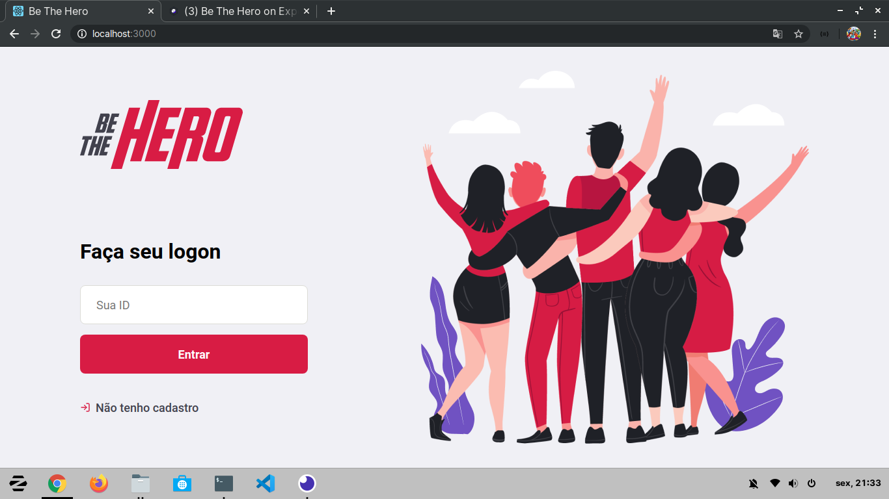
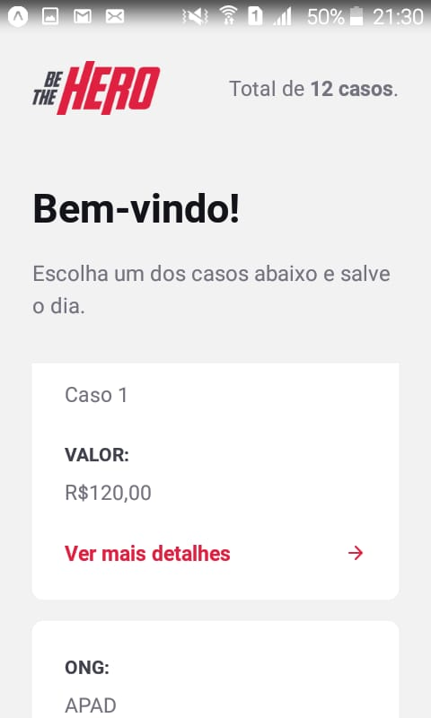

<div align="center">
    
    <p><strong>Projeto desenvolvido durante a semana omnistack 11</strong></p>
    <p>Site: <a href="https://bethehero-front.netlify.com/">Be The Hero</a></p>
    
    
</div>

## Requisitos

- [Nodejs](https://nodejs.org/en/)
- npm

<h2>Sobre</h2>
<p>A aplicação desenvolvida tem o objetivo de ajudar ONGs que podem cadastrar novos casos no site, deste modo as pessoas podem contribuir com o valor de cada caso através do aplicativo.</p>

<h2>Instalação</h2>
<h3>Backend - Frontend - Mobile</h3>
<p>Digite: <code>npm install</code> dentro da pasta backend, frontend e mobile</p>

## Configuração
No mobile altere o arquivo [api.js](mobile/src/services/api.js#L4)

```
baseURL: 'http://yourIP:3333'
```

## Execução
Para executar digite: ```npm start```

## Licença:
[MIT](https://choosealicense.com/licenses/mit/)